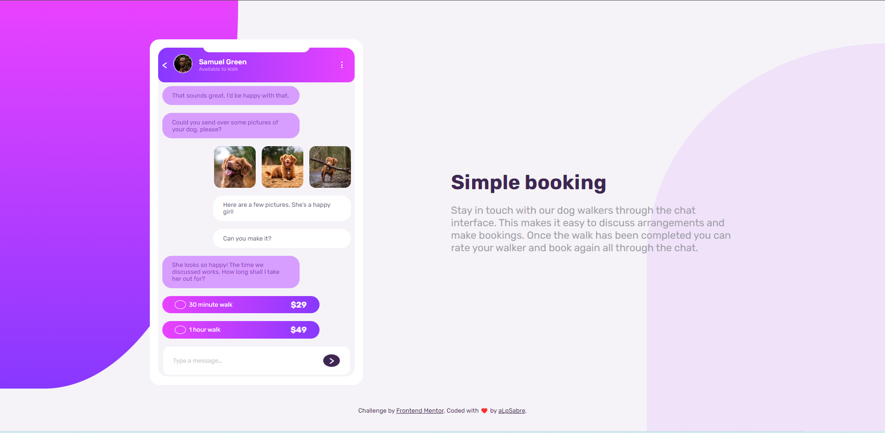
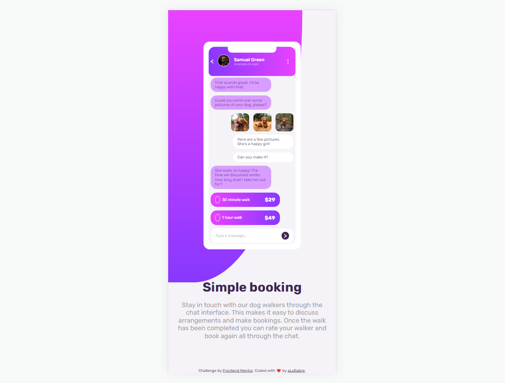

# Frontend Mentor - Chat app CSS illustration solution

This is a solution to the [Chat app CSS illustration challenge on Frontend Mentor](https://www.frontendmentor.io/challenges/chat-app-css-illustration-O5auMkFqY). Frontend Mentor challenges help you improve your coding skills by building realistic projects. 

## Table of contents

- [Overview](#overview)
  - [The challenge](#the-challenge)
  - [Screenshot](#screenshot)
  - [Links](#links)
- [My process](#my-process)
  - [Built with](#built-with)
  - [What I learned](#what-i-learned)
  - [Useful resources](#useful-resources)


## Overview

### The challenge

Users should be able to:

- View the optimal layout for the component depending on their device's screen size
- **Bonus**: See the chat interface animate on the initial load

### Screenshot





### Links

- Solution URL: [Solution URL here](https://github.com/aLpSabre/Frontend-Mentor-Projects/tree/main/chat-app-css-illustration-master)
- Live Site URL: [Live site URL here](https://alpsabre.github.io/Frontend-Mentor-Projects/chat-app-css-illustration-master/)

## My process

### Built with

- Semantic HTML5 markup
- CSS custom properties
- Flexbox
- CSS Grid
- SASS/SCSS


### What I learned

I learned how to import modules and create variables and mixins in SASS/SCSS.

You can find an example for usage of mixin  and import modules in SASS/SCSS.
#
```css
@mixin flex() {
  display: flex;
  justify-content: center;
  align-items: center;
}
body{
  @include flex();
}
```
#
```css
@import "./abstract/colors","./abstract/mixins","./abstract/variables";
@import "./components/body","./components/container","./components/info","./components/phone";
@import "./base/reset";
```
I also learned to use border radius in another way.You can see the code below.

#
```css
.phone .wrapper .header {
  border-top-left-radius: 15px;
  border-top-right-radius: 15px;
  border-bottom-left-radius: 10px;
  border-bottom-right-radius: 10px;
  
}
```

### Useful resources

- [FANCY-BORDER-RADIUS](https://9elements.github.io/fancy-border-radius/) - This helped me for making the shapes at the top-left and bottom-right of the page.
- [W3Schools](https://www.w3schools.com/) - This is an amazing website to find overall information about a lot of programming languages.


