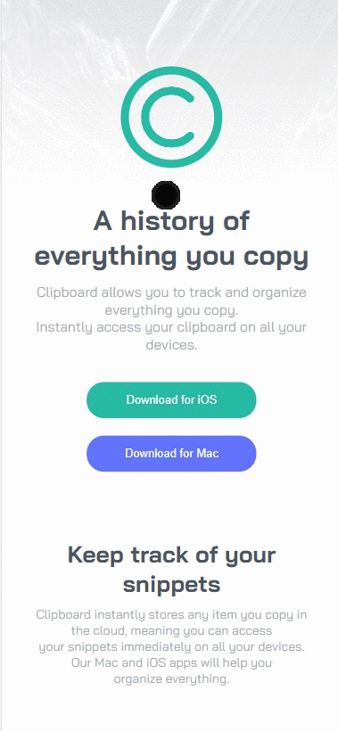

# Frontend Mentor - Clipboard landing page solution

This is a solution to the [Clipboard landing page challenge on Frontend Mentor](https://www.frontendmentor.io/challenges/clipboard-landing-page-5cc9bccd6c4c91111378ecb9). Frontend Mentor challenges help you improve your coding skills by building realistic projects. 

## Table of contents

- [Overview](#overview)
  - [The challenge](#the-challenge)
  - [Screenshot](#screenshot)
  - [Links](#links)
- [My process](#my-process)
  - [Built with](#built-with)
  - [What I learned](#what-i-learned)
  - [Continued development](#continued-development)

## Overview

### The challenge

Users should be able to:

- View the optimal layout for the site depending on their device's screen size
- See hover states for all interactive elements on the page

### Screenshot

Desktop-view

 

  
Mobile-view
 
 

### Links

- Solution URL: [Add solution URL here](https://github.com/aLpSabre/Frontend-Mentor-Projects/tree/main/clipboard-landing-page-master)
- Live Site URL: [Add live site URL here](https://alpsabre.github.io/Frontend-Mentor-Projects/clipboard-landing-page-master/)

## My process

### Built with

- Semantic HTML5 markup
- CSS custom properties
- Flexbox

### What I learned

I improved my knowledge about Responsive Web Design and had a chance to use it in a real-project.

### Continued development

I am planing to add some animations with CSS.

